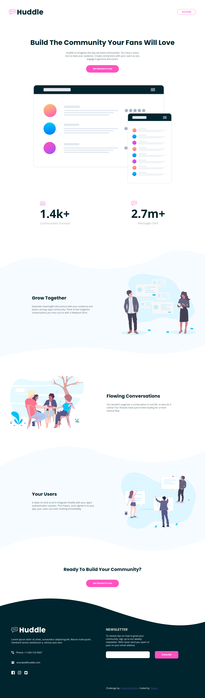
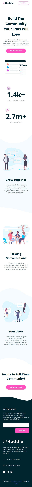
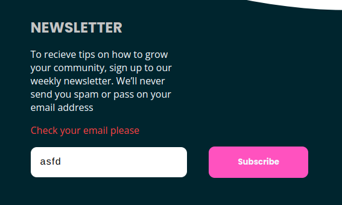

# Frontend Mentor - Huddle landing page with curved sections solution

This is a solution to the [Huddle landing page with curved sections challenge on Frontend Mentor](https://www.frontendmentor.io/challenges/huddle-landing-page-with-curved-sections-5ca5ecd01e82137ec91a50f2). Frontend Mentor challenges help you improve your coding skills by building realistic projects.

## Table of contents

- [Overview](#overview)
  - [The challenge](#the-challenge)
  - [Screenshot](#screenshot)
  - [Links](#links)
- [My process](#my-process)
  - [Built with](#built-with)
  - [What I have learned](#what-i-have-learned)
  - [Continued development](#continued-development)
- [Author](#author)

## Overview

### The challenge

Users should be able to:

- View the optimal layout for the site depending on their device's screen size
- See hover states for all interactive elements on the page

### Screenshot





### Links

- Solution URL: [Solution URL here](https://github.com/Tiyana19/Huddle-landing-page-with-curved-sections)
- Live Site URL: [Live site URL here](https://tiyana19.github.io/Huddle-landing-page-with-curved-sections/)

## My process

### Built with

- Semantic HTML5 markup
- CSS custom properties
- Flexbox
- CSS Grid
- DOM Manipulation

### What I have learned

- JavaScript

```
 function emailValidator(email) {
       let regex =
         /^(([^<>()[\]\\.,;:\s@\"]+(\.[^<>()[\]\\.,;:\s@\"]+)*)|(\".+\"))@((\[[0-9]{1,3}\.[0-9]{1,3}\.[0-9]{1,3}\.[0-9]{1,3}\])|(([a-zA-Z\-0-9]+\.)+[a-zA-Z]{2,}))$/;
       return regex.test(String(email).toLowerCase());
 }

```

this will first turn the `email` into a string then turn every letters into lower case and then with the help of `test method` check every letter of `email` with varible `regex` if the letters in `email` are present in `regex variable` then it will return
`true`

### Continued development

In this project, I have been struggling with background wave images. SO I will keep on practising with them.

## Author

- Frontend Mentor - [@yourusername](https://www.frontendmentor.io/profile/Tiyana19)
